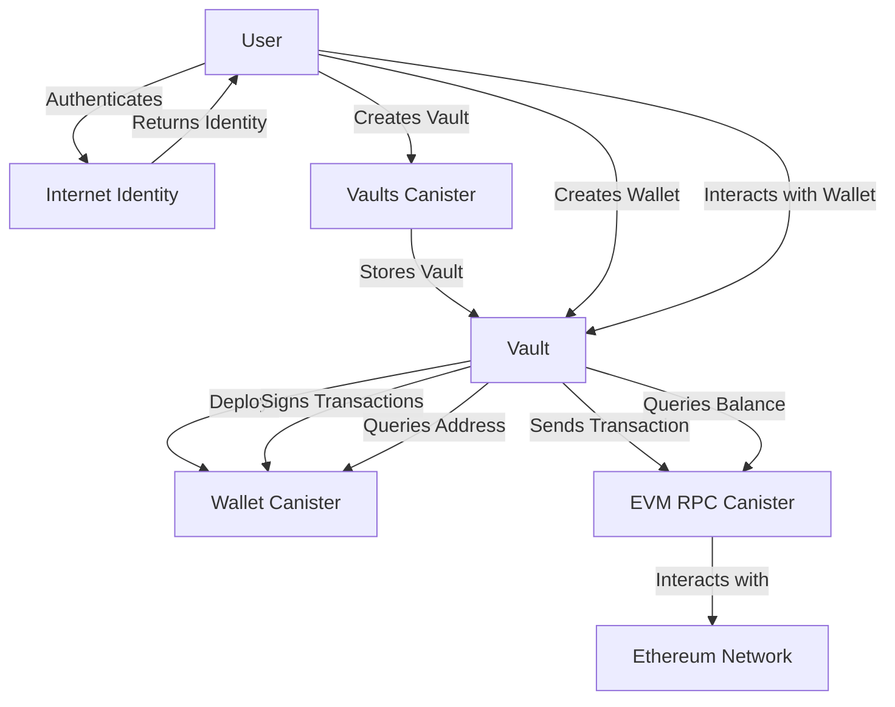

# Cerberus
💝 This project received a $2500 grant from the DFINITY foundation.

## Overview



## Explanation
## Components and Their Roles

### User
- Represents the end-user interacting with the system.
- Authenticates through Internet Identity to obtain an identity.
- Creates Vaults and Wallets.
- Interacts with Wallets to sign transactions, send transactions, query balances, and query addresses.

### Internet Identity
- Provides authentication services for the User.
- Returns an identity to the User upon successful authentication.

### Vaults Canister
- Stores and manages Vaults created by Users.
- Provides functionality to create, retrieve, and update Vaults.

### Vault
- Represents a container for Wallets created by the User.
- Deploys a Wallet Canister for each Wallet created within the Vault.
- Stores and manages Wallets.

### Wallet Canister
- Represents a canister that is deployed for each Wallet created within a Vault.
- Provides functionality for signing transactions and querying Wallet addresses.
- Interacts with the Wallet to perform various operations.

### EVM RPC Canister
- Acts as an intermediary between the Wallets and the Ethereum Network.
- Receives transaction requests from Wallets and forwards them to the Ethereum Network.
- Handles balance queries from Wallets and retrieves the information from the Ethereum Network.
- Returns the results of transactions and queries back to the Wallets.

### Ethereum Network
- Represents the external Ethereum blockchain network.
- Receives transaction requests from the EVM RPC Canister and processes them.
- Provides balance information to the EVM RPC Canister upon request.

## Interactions

1. The User authenticates through Internet Identity to obtain an identity.
2. The User creates a Vault using the Vaults Canister, which stores the Vault.
3. The User creates a Wallet within a Vault, triggering the deployment of a Wallet Canister.
4. The User interacts with the Wallet to perform various operations:
  - Signing transactions: The Wallet sends a request to the Wallet Canister to sign the transaction.
  - Sending transactions: The Wallet sends the signed transaction to the EVM RPC Canister, which forwards it to the Ethereum Network for processing.
  - Querying balances: The Wallet sends a balance query to the EVM RPC Canister, which retrieves the balance information from the Ethereum Network and returns it to the Wallet.
  - Querying addresses: The Wallet sends an address query to the Wallet Canister, which returns the Wallet's address.

The EVM RPC Canister acts as a bridge between the Wallets and the Ethereum Network, handling transaction requests, balance queries, and relaying the results back to the Wallets.

This design allows Users to securely manage their Vaults and Wallets, interact with the Ethereum Network through the EVM RPC Canister, and perform various operations such as signing transactions, sending transactions, and querying balances and addresses.

## Installation
If you want to test your project locally, you can use the following commands:

```bash
dfx deps pull
dfx deps deploy evm_rpc
dfx deps deploy internet_identity
```

# Starts the replica, running in the background
dfx start --background

# Deploys your canisters to the replica and generates your candid interface
dfx deploy
```

Once the job completes, your application will be available at `http://localhost:4943?canisterId={asset_canister_id}`.

If you have made changes to your backend canister, you can generate a new candid interface with

```bash
npm run generate
```

at any time. This is recommended before starting the frontend development server, and will be run automatically any time you run `dfx deploy`.
